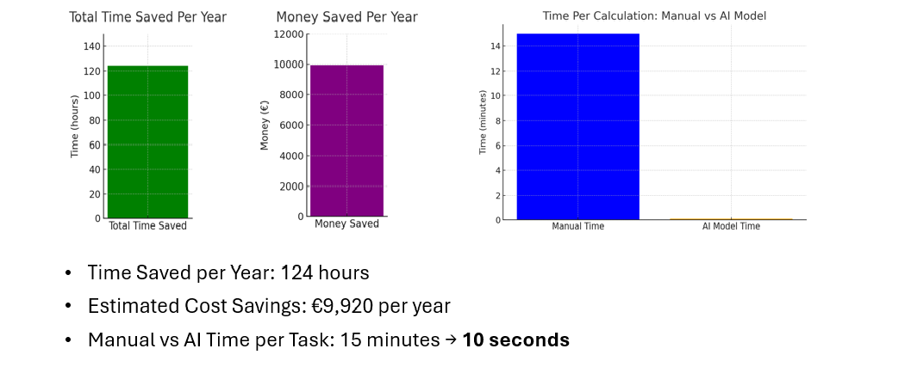

# Charging Station Selection for Electric Heavy Machinery (Rule-Based)

A Python rule-based decision system that filters and ranks EV charging stations for electric heavy machinery and portable battery containers using **distance**, **availability**, and **total cost**. The project also estimates **charging time** and considers real-world factors such as **temperature impact**, **usable capacity limitations**,  **extra power consumptions** and **heavy working cycles**.

---

## Problem

Selecting a charging station in real-world construction scenarios is not only about the cheapest kWh price. You also need to consider:
- How far the station is from the site
- Whether it is available
- How much energy is required based on state-of-charge (SOC)
- Charging limits (battery input/output power, vehicle charging speed)
- Extra energy needs due to cold temperature, standby loads, and heavy working periods
- Usable battery capacity is limited to less than 100% of nominal capacity

Manual selection can be time-consuming and inconsistent when many stations exist.

---

## What this project does

Given user inputs (machine, portable battery, SOC, location, etc.), the notebook:

1. Loads datasets:
   - Heavy machinery specs (battery capacity, charging speed, power)
   - Portable battery container specs (capacity, power input/output)
   - EV charging station dataset (location, availability, cost per kWh, station capacity)

2. Computes the site-to-station distance using geodesic coordinates

3. Filters stations by:
   - **Distance ≤ 5 km**
   - **Availability > 0**

4. Calculates required charging energy from SOC:
   - Usable capacity is assumed **90%** of nominal for longevity
   - `Required_energy = Usable_capacity - current_energy`

5. Ranks stations using a total cost function:
   - `Total Cost = (Required_energy * Cost_per_Unit) + (t * Distance)`
   - Where `t` is a distance penalty weight ($/km)

6. Returns the **Top 5 cheapest stations** and visualizes:
   - All accepted stations on a map
   - Top 5 stations on a map

7. Estimates charging time for:
   - Portable battery container charging time
   - Heavy machine charging time (limited by min(vehicle charging speed, battery power output))

8. Adds real-world scenario adjustments:
   - Temperature-based extra energy demand
   - Limitation of total usable battery capacity
   - Standby consumption (cooling/heating + electronics + startup)
   - Heavy vs normal working energy split

---

## Requirements

- Python 3.9 or higher
- pandas
- openpyxl
- geopy
- plotly
- jupyter


## Repository Structure

```txt
.
├─ notebooks/
│  └─ charging_station_selection.ipynb
├─ data/
│  ├─ Heavy_machinery_dataset.xlsx
│  ├─ Portable_battery_dataset.xlsx
│  └─ EV_stations_dataset.xlsx
├─ Pics/
│  ├─ optimization_map.png
│  └─ key_results.png
├─ requirements.txt
└─ README.md
```

## Inputs

### User Inputs (during runtime)
The user is prompted to enter:
- Machine number (row index from the heavy machinery dataset)
- Battery number (row index from the portable battery dataset)
- Battery state of charge (SOC) in percentage (%)
- Machine state of charge (SOC) in percentage (%)
- Ambient temperature in °C

## Outputs

The notebook produces:
- A filtered table of charging stations that satisfy distance and availability conditions
- A ranked table of the top 5 cheapest charging stations
- Interactive maps showing:
  - All accepted stations and the reference site
  - The top 5 cheapest stations and the reference site
- Estimated charging time for:
  - Portable battery container
  - Heavy machinery
- Estimated total daily energy demand considering real-world conditions
- Below is an example of the charging station selection process.  
The system filters all available stations and selects the top 5 cheapest options based on the defined cost function.


## How to Run

1. Clone the repository:
```bash
git clone https://github.com/danielllll75/rule-based-optimization.git
```
2. Navigate to the project folder:
```bash
cd <rule-based-optimization>
```
3. Install required packages:
```bash
pip install -r requirements.txt
```
4. Start Jupyter Notebook:
```bash
jupyter notebook
```
5. Open the notebook and run all cells:
```bash
notebooks/charging_station_selection.ipynb
```
## Notes & Assumptions

- Only 90% of nominal battery capacity is considered usable to account for battery longevity
- Charging stations are filtered using:
  - Maximum distance: 5 km
  - Availability > 0
- A distance penalty factor of 100 $/km is applied in the total cost calculation
- Charging speed is limited by the minimum of vehicle charging speed and battery power output
- Temperature-based energy losses are estimated using simplified rule-based logic suitable for the Netherlands climate

## Key Results

- The system consistently selected the same optimal charging station as manual calculations
- Decision time was reduced from **15 minutes to 10 seconds**
- The model could save almost **124 hours in a year**
- The model also could save **€9,920**
- The rule-based approach proved reliable for real-world scenarios
- The rule-based system significantly reduces decision-making time and operational cost compared to manual calculations.



## Limitations

- Fixed rule weights are used instead of adaptive optimization
- No real-time data (grid congestion, queue length, dynamic pricing)
- The construction site reference point is currently hard-coded
- Assumes simplified thermal and standby consumption models

## Future Work

- Add real-time data sources for station availability and pricing
- Replace fixed rules with machine learning–based ranking models
- Introduce multi-objective optimization (cost, time, reliability)
- Externalize parameters using configuration files
- Deploy the logic as a backend service or dashboard

## Project Context

This project was developed as part of a Master's thesis in Smart Systems Engineering (AI & Data Engineering) in collaboration with an industry partner in the construction sector.

## Author

Daniel Amirahmadi  
MSc Smart Systems Engineering (AI & Data Engineering), 
Hanze University of Applied Sciences

Email: danielamirahmadi@gmail.com
LinkedIn: [www.linkedin.com/in/daniel-amirahmadi]

